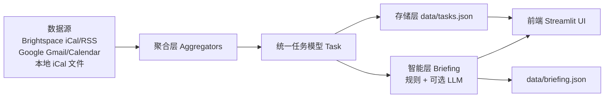

# Nexus 项目说明（中文）

Nexus 是一个轻量化的个人助手仪表盘，目标是“打开后 3 秒内知道今天需要关注什么”。它聚合多来源数据（课程平台、日历、邮件），统一成任务模型，再通过规则或 LLM 生成简洁摘要，并以 Streamlit 前端呈现。

---

## 1. 总体架构（数据流）



---

## 2. 技术栈与组件

- 语言与运行时
  - Python 3
- 前端
  - Streamlit（单页应用）
  - CSS + `unsafe_allow_html` 注入定制样式
- 后端与数据处理
  - `requests`, `feedparser`, `icalendar`（抓取 iCal/RSS）
  - Google API Client（Gmail / Calendar 只读）
- 可选智能生成
  - OpenAI 兼容接口的 LLM（通过环境变量配置）

依赖见：`/Users/rzzz/Desktop/Workspace/Projects/Nexus/requirements.txt`

---

## 3. 目录结构与职责

```
Nexus/
├─ data/
│  ├─ feeds.json              # 数据源配置
│  ├─ tasks.json              # 统一任务列表（聚合后的结果）
│  ├─ briefing.json           # LLM/规则生成的摘要（可选）
│  ├─ google_client_secret.json
│  └─ google_token.json
├─ src/nexus/
│  ├─ aggregators/            # 各数据源采集器
│  │  ├─ base.py               # 抽象基类
│  │  ├─ brightspace.py        # Brightspace iCal/RSS
│  │  └─ google.py             # Gmail + Calendar
│  ├─ intelligence/
│  │  ├─ briefing.py           # 规则/LLM 摘要生成
│  │  └─ llm.py                # LLM 客户端
│  ├─ streamlit_app.py         # 前端界面
│  ├─ aggregation.py           # 聚合入口
│  ├─ storage.py               # 读写 data/*.json
│  ├─ models.py                # Task / FeedSource 数据模型
│  ├─ briefing_cli.py          # CLI 生成 briefing.json
│  └─ google_auth.py           # Google 授权
└─ README.md
```

---

## 4. 数据模型与存储

### 4.1 Task（统一任务模型）
定义位置：`/Users/rzzz/Desktop/Workspace/Projects/Nexus/src/nexus/models.py`

核心字段：
- `id`: 稳定 ID（由数据源信息哈希生成）
- `title`: 任务标题
- `due_at`: 截止/发生时间（可为空）
- `source`: 来源（`brightspace` / `gmail` / `gcal` 等）
- `course`: 课程名（可为空）
- `tags`: 分类标签（`assignment` / `exam` / `announcement` / `deadline` 等）
- `snippet`: 邮件摘要等

所有数据最终统一到 `data/tasks.json`，前端直接读取。

### 4.2 FeedSource（数据源配置）
定义位置：`/Users/rzzz/Desktop/Workspace/Projects/Nexus/src/nexus/models.py`

配置文件：`/Users/rzzz/Desktop/Workspace/Projects/Nexus/data/feeds.json`
- 支持 `brightspace_ical` / `brightspace_rss` / `ical_file`
- 可配置 `mode`（例如 `exams_only` / `assignments_only`）
- 可配置 `audience`（`ui` / `llm`）

---

## 5. 后端数据处理（聚合层）

### 5.1 聚合入口
`/Users/rzzz/Desktop/Workspace/Projects/Nexus/src/nexus/aggregation.py`

逻辑：
1. 读取 `feeds.json`
2. 对 Brightspace iCal / RSS 拉取并解析
3. 对 Google Gmail / Calendar 拉取（需授权）
4. 统一为 Task 列表并去重
5. 写入 `data/tasks.json`

### 5.2 Brightspace 聚合器
`/Users/rzzz/Desktop/Workspace/Projects/Nexus/src/nexus/aggregators/brightspace.py`

功能：
- iCal 解析（`icalendar`）
- RSS 解析（`feedparser`）
- 识别 `assignment` / `exam` 标签
- 生成稳定 ID（hash）

### 5.3 Google 聚合器
`/Users/rzzz/Desktop/Workspace/Projects/Nexus/src/nexus/aggregators/google.py`

功能：
- Gmail：读取未读邮件，提取标题/发件人/摘要
- Calendar：读取未来 7 天事件
- 课程名推断（根据 subject 或别名）

---

## 6. 智能层（Briefing）

位置：`/Users/rzzz/Desktop/Workspace/Projects/Nexus/src/nexus/intelligence/briefing.py`

功能：
- 按时间窗口筛选任务（默认 7 天）
- 规则化去噪（如非行动类公告）
- 可选 LLM：生成“简短双语摘要”
- 产出 `briefing.json`

LLM 逻辑位于：`/Users/rzzz/Desktop/Workspace/Projects/Nexus/src/nexus/intelligence/llm.py`
- 使用 OpenAI 兼容接口
- 通过 `NEXUS_LLM_*` 环境变量配置

---

## 7. 前端 UI（渲染方式）

位置：`/Users/rzzz/Desktop/Workspace/Projects/Nexus/src/nexus/streamlit_app.py`

关键点：
- 使用 Streamlit 渲染
- 通过 `st.markdown(..., unsafe_allow_html=True)` 注入 CSS
- 自定义卡片样式、颜色编码、hover 展示更多信息
- 渲染逻辑直接读取 `data/tasks.json`

界面分层：
1. 顶部状态栏：当前时间 + 动态提示
2. 需要关注（< 3 天）
3. 即将到来（3–7 天）
4. 其他（> 7 天 或课程更新）折叠展示

---

## 8. 组件之间如何互联

1. 聚合器层（Aggregators）统一抓取数据 → Task 列表
2. Storage 层保存 Task 到 `data/tasks.json`
3. 智能层（Briefing）读取 Task，生成摘要 → `briefing.json`
4. 前端 UI 直接读取 Task +（可选）Briefing
5. 用户界面通过时间与标签规则进行分组、排序和样式编码

---

## 9. 运行方式（常见工作流）

### 9.1 聚合并生成摘要
```bash
python -m nexus.briefing_cli --aggregate
```

### 9.2 启动前端
```bash
streamlit run /Users/rzzz/Desktop/Workspace/Projects/Nexus/src/nexus/streamlit_app.py
```

---

## 10. 扩展建议

- 新增数据源：实现 `Aggregator.fetch_tasks()` 并注册进 `aggregation.py`
- 新增标签：在聚合器里追加 tags，前端即可自动获得分类样式
- 新增 UI 模块：在 `streamlit_app.py` 内增加新分区

---

如需更细致的模块调用图或具体扩展指导，可以继续告诉我。你也可以指定“只写给新成员的快速上手版”或“面向产品的功能介绍版”。
